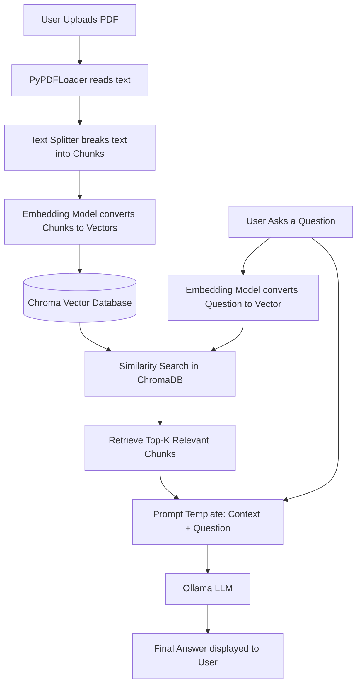

# Chat with PDF using RAG: A Beginner's Guide

Welcome to your first Retrieval-Augmented Generation (RAG) project! This guide will explain every step of the process, from theory to execution, in a beginner-friendly manner.

---

## 1. Project Architecture & Data Flow

RAG is a technique that gives large language models (LLMs) the ability to access custom data (like your private PDFs) before answering a question.

### The Data Flow Diagram


---

## 2. Core Concepts Explained

### 2.1 Chunking
**What is it?** Breaking a massive document into smaller, manageable pieces (chunks).
**Why?** 
1. LLMs have a "context window limit"—they can't read an entire book at once.
2. Searching for a specific fact is much more accurate if you search through paragraphs rather than 100-page chapters.
**Example:**
*Original text:* "The sky is blue. The grass is green. The sun is yellow."
*Chunks (size=2 sentences):* 
- Chunk 1: "The sky is blue. The grass is green."
- Chunk 2: "The grass is green. The sun is yellow." *(Notice the overlap? Overlap prevents cutting a concept in half!)*

### 2.2 Embeddings
**What is it?** Converting text into an array of numbers (a vector).
**Why?** Computers don't understand words; they understand math. If we map words to numbers in a multi-dimensional space, words with similar meanings will be placed close together.
**Example:**
"Dog" might become `[0.12, 0.45, 0.88]`
"Puppy" might become `[0.15, 0.42, 0.85]`
"Car" might become `[-0.99, -0.11, 0.05]`
*Notice how Dog and Puppy have similar numbers, but Car is completely different.*

### 2.3 Vector Databases (ChromaDB)
**What is it?** A special database designed to store and search through arrays of numbers (vectors) efficiently.
**Why?** A regular SQL database searches for exact matches (`SELECT * WHERE word='Dog'`). A vector database searches for *similar* items using math, so searching for "Canine" will still return results for "Dog".

### 2.4 Similarity Search (Cosine Similarity)
**What is it?** The mathematical formula used to determine how close two vectors are to each other.
**How it works:** Imagine drawing arrows from the origin (0,0) to your vectors on a graph. If the angle between the two arrows is small (close to 0 degrees), the texts are very similar. The Cosine Similarity value approaches 1 for identical concepts and 0 (or -1) for unrelated concepts.

### 2.5 LangChain Orchestration
**What is it?** A framework that acts as the "glue" connecting all these pieces together. It provides the standard interfaces for loading PDFs, splitting text, embedding, retrieving, and talking to the LLM.

### 2.6 Ollama
**What is it?** A tool that allows you to run large language models (like Llama 3.1) entirely on your local machine. No data is sent to the internet!

---

## 3. Folder Structure Explanation

```text
rag_project/
│
├── app.py                 # The Streamlit frontend. It links all backend logic to a UI.
├── requirements.txt       # The list of Python libraries needed to run the code.
├── config.py              # Central place for settings (model names, chunk sizes, paths).
├── data/                  # Where uploaded PDFs are temporarily saved.
├── vectorstore/           # Where ChromaDB saves the vector database to your hard drive.
├── loaders/
│   └── pdf_loader.py      # Contains logic to read PDFs and split them into chunks.
├── embeddings/
│   └── embedding.py       # Initializes the HuggingFace model to turn text into vectors.
├── rag/
│   ├── retriever.py       # Manages saving to and searching from ChromaDB.
│   └── chain.py           # Builds the final Prompt and connects to the Ollama LLM.
├── utils/                 # Utilities (currently empty, but good for future helper functions).
└── README.md              # This guide!
```

---

## 4. Installation & Running Instructions

### Step 1: Install Python and Create a Virtual Environment
You need Python 3.11+. Open your terminal in the `rag_project` folder:
```bash
# Create virtual environment
python -m venv venv

# Activate it (Windows)
.\venv\Scripts\activate

# Activate it (Mac/Linux)
source venv/bin/activate
```

### Step 2: Install Python Packages
```bash
pip install -r requirements.txt
```

### Step 3: Install and Run Ollama
1. Download Ollama from [ollama.com](https://ollama.com/).
2. Open a new terminal and run:
   ```bash
   ollama run llama3.1
   ```
   *Note: This will download the Llama 3.1 model (approx 4.7GB). Keep this terminal running!*

### Step 4: Run the Application
Go back to your first terminal (where your virtual environment is active) and run:
```bash
streamlit run app.py
```
This will open a browser window. Upload a PDF and start chatting!

---

## 5. Common Errors and Fixes

1. **`ConnectionError: HTTPConnectionPool...`**
   - *Cause:* Ollama is not running in the background.
   - *Fix:* Ensure you have a terminal open running `ollama serve` or `ollama run llama3.1`.
2. **`ModuleNotFoundError: No module named 'langchain'`**
   - *Cause:* Virtual environment is not activated or packages weren't installed.
   - *Fix:* Run the activation command and `pip install -r requirements.txt` again.
3. **Out of Memory (OOM) Errors**
   - *Cause:* The embedding model or LLM is taking up too much RAM.
   - *Fix:* In `config.py`, change the model to a smaller one, or close other heavy applications.

---

## 6. Testing the Project
1. Find a sample PDF (e.g., a Wikipedia article printed to PDF, or a short manual).
2. Upload it via the Streamlit sidebar.
3. Wait for the success message.
4. Ask a specific question that can ONLY be answered by reading the PDF.
5. If the bot answers correctly, your RAG pipeline is working!

---

## 7. Suggested Improvements (For the Future)
Once you master this basic version, try adding:
1. **Chat History Memory:** Currently, the LLM treats every question independently. You can add `ConversationBufferMemory` in LangChain so it remembers previous questions.
2. **Multiple Documents:** Modify `pdf_loader.py` to iterate through an entire folder of PDFs instead of just one.
3. **Hybrid Search:** Combine Vector Search (meaning) with Keyword Search (exact words) using tools like BM25 for even better retrieval accuracy.
